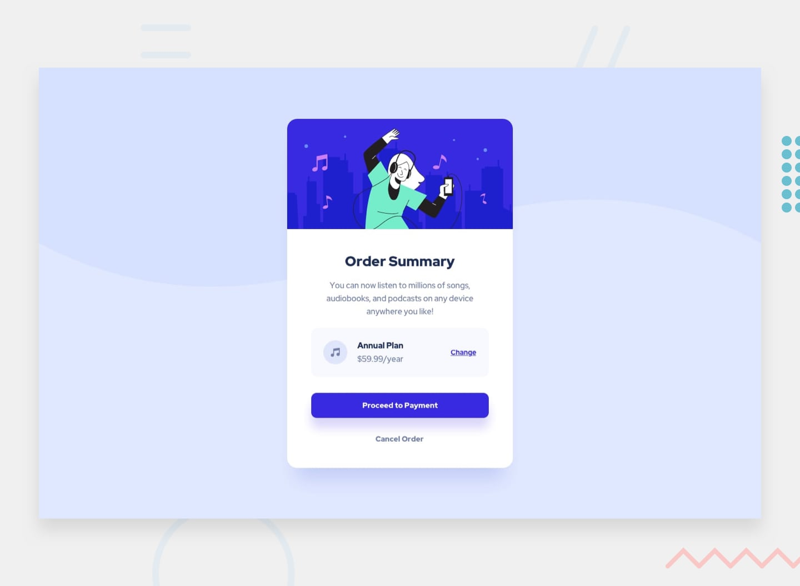

# Frontend Mentor - Order summary card solution

## Welcome! 👋
Thanks for checking out this front-end coding challenge.

## Overview

This is a solution to the [Order summary card challenge on Frontend Mentor]

### The challenge

Users should be able to:

- See hover states for interactive elements

### Links

- Solution URL: (https://github.com/Shaheen121/Order-summary-component.git)
- Live Site URL: (https://shaheen121.github.io/Order-summary-component/m)

## My process

### Built with

- Semantic HTML5 markup
- CSS custom properties
- Flexbox
## Author

- Frontend Mentor - [@shaheen121](https://www.frontendmentor.io/profile/Shaheen121)
- Facebook - [@aoushaheen7](https://www.facebook.com/shaheen7tl/)

By me 🚀🚀🚀
Aous Shaheen
